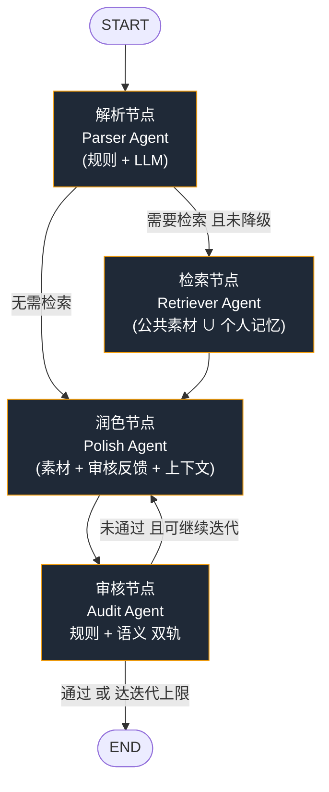

# Drama Multi Agent · 短剧多智能体内容生产系统

> English: A multi-agent short-drama content production system built on **FastAPI + LangGraph**. It turns a creative brief into a structured task, retrieves reference materials, drafts & refines the script, and runs a two-track compliance audit — with session memory, a personal memory library, an MCP server, and a real-time web UI.

> 💡 把下方 CI 徽标中的 `<owner>/<repo>` 替换为你自己的 GitHub 仓库路径即可。

[](https://www.python.org/)
[](https://fastapi.tiangolo.com/)
[](https://www.langchain.com/langgraph)
[](LICENSE)
[](https://github.com/%3Cowner%3E/%3Crepo%3E/actions/workflows/ci.yml)
[](https://github.com/%3Cowner%3E/%3Crepo%3E/pulls)

------

## 目录

- [项目简介](#项目简介)
- [核心特性](#核心特性)
- [系统架构](#系统架构)
- [项目结构](#项目结构)
- [环境要求](#环境要求)
- [快速开始](#快速开始)
- [运行服务](#运行服务)
- [构建知识库索引](#构建知识库索引)
- [Web UI 使用说明](#web-ui-使用说明)
- [REST API](#rest-api)
- [MCP 工具](#mcp-工具)
- [测试](#测试)
- [常见问题](#常见问题)
- [开发指南](#开发指南)
- [Roadmap](#roadmap)
- [贡献指南](#贡献指南)
- [License](#license)

------

## 项目简介

短剧多智能体内容生产系统。项目基于 **FastAPI + LangGraph + FAISS + sentence-transformers + OpenAI 兼容大模型接口**，提供从需求解析、素材检索、内容生成、合规审核到会话 / 个人记忆沉淀的一体化短剧创作工作流。

如果没有配置 LLM API Key，系统会进入本地 **Stub 模式**，仍可跑通完整流程，适合做 UI 和 API 联调。

------

## 核心特性

- **多 Agent 工作流**：任务解析、素材检索、内容润色、合规审核四类节点协同运行。
- **LangGraph 调度**：使用 `StateGraph` 组织条件路由、审核反馈（反思迭代）与降级容错。
- **可视化前端**：内置单页 Web UI，实时展示 SSE 事件流、节点状态、生成结果和审核报告。
- **个人记忆库**：用户先预览生成内容，再手动确认是否保存为个人 Q&A 记忆；相似问题会自动召回参考。
- **会话记忆**：支持多轮对话、用户画像学习、反思日志与会话持久化（JSON）。
- **知识库检索**：支持将本地素材构建为 FAISS 向量索引，并在生成前召回相关上下文。
- **合规审核**：规则引擎 + LLM 语义审核双轨并行，审核未通过时触发重写。
- **多种调用方式**：Web UI、REST API、SSE 流式接口、CLI、MCP Server、Docker 均可运行。

------

## 系统架构

工作流由 LangGraph `StateGraph` 统一编排，核心是一条带反思回路的有向图：



请求入口与运行路径：

```text
User / Web UI / REST API / SSE / CLI / MCP
        |
        v
FastAPI service  ──  GET /  (前端)  ·  /v1/generate  ·  /v1/stream  ·  /v1/async/*
        |
        v
LangGraph StateGraph
        |
        +--> Parser Agent      解析任务类型、主题、约束、风格
        +--> Retriever Agent   检索公共素材与个人记忆（空库不降级）
        +--> Polish Agent      生成 / 润色短剧内容
        +--> Audit Agent       规则审核 + LLM 语义审核
        |
        v
Final response + audit report + session memory + (可选) 个人记忆召回
```

------

## 项目结构

```text
drama-multi-agent/
├── frontend/
│   └── index.html              # 可视化前端页面（FastAPI 根路径直接返回）
├── src/drama_agent/
│   ├── api.py                  # FastAPI 路由（REST / SSE / 异步 / 记忆 / 会话）
│   ├── graph.py                # LangGraph 工作流编排与节点包装
│   ├── llm.py                  # OpenAI 兼容 LLM 客户端
│   ├── config.py               # 全局配置（pydantic-settings，读取 .env）
│   ├── models.py               # Pydantic 数据模型
│   ├── memory.py               # 会话记忆、用户画像、反思日志
│   ├── mcp_server.py           # MCP Server（stdio）
│   ├── exceptions.py           # 异常与重试装饰器
│   ├── logging_setup.py        # 日志初始化（loguru）
│   ├── __main__.py             # CLI 入口（serve / run / tools / mcp）
│   ├── agents/                 # Parser / Retriever / Polish / Audit / prompts
│   └── tools/                  # 向量检索 / 合规 / 文本处理 / 个人记忆 / embedding / 注册中心
├── scripts/
│   ├── build_knowledge.py      # 构建 FAISS 知识库索引
│   └── api_test.py             # API 快速测试脚本
├── tests/                      # pytest 单元测试
├── data/
│   ├── knowledge/              # 自定义素材（剧本 / 文案 / 人设 等）
│   ├── faiss_index/            # FAISS 向量索引
│   ├── user_memory/            # 个人记忆库
│   └── sessions/               # 会话持久化文件
├── .github/workflows/ci.yml    # GitHub Actions：多版本 Python 测试
├── pyproject.toml
├── requirements.txt
├── .env.example
├── Dockerfile
├── docker-compose.yml
└── LICENSE
```

------

## 环境要求

- Python 3.10+
- Windows / macOS / Linux
- 可选：DeepSeek、豆包、OpenAI 或任意 OpenAI 兼容接口的 API Key
- 可选：Docker / Docker Compose

------

## 快速开始

### 1. 获取项目

```bash
git clone <your-repo-url>
cd drama-multi-agent
```

### 2. 创建并激活虚拟环境

```bash
# 通用（macOS / Linux / Windows Git Bash）
python -m venv .venv
source .venv/bin/activate        # macOS / Linux
# .venv\Scripts\activate          # Windows CMD
# .\.venv\Scripts\Activate.ps1    # Windows PowerShell
```

### 3. 安装依赖

```bash
pip install -r requirements.txt
pip install -e .
```

可选安装开发依赖（测试 / MCP / 本地 embedding）：

```bash
pip install -e ".[dev,mcp]"
```

### 4. 配置环境变量

复制配置模板：

```bash
cp .env.example .env          # macOS / Linux
# Copy-Item .env.example .env # Windows PowerShell
```

常用配置（完整字段见 `.env.example`）：

```ini
# 大模型（任选其一，OpenAI 兼容接口即可）
LLM_API_KEY=sk-your-api-key
LLM_BASE_URL=https://api.deepseek.com/v1
LLM_MODEL=deepseek-chat
LLM_TEMPERATURE=0.7
LLM_TIMEOUT=120

# Embedding（安装 sentence-transformers 后启用本地向量）
EMBEDDING_MODEL=BAAI/bge-small-zh-v1.5
EMBEDDING_DIM=512

# 向量检索 / 个人记忆 / 服务
VECTOR_INDEX_PATH=data/faiss_index
MATERIAL_KNOWLEDGE_PATH=data/knowledge
USER_MEMORY_PATH=data/user_memory
ENABLE_USER_MEMORY=true
API_HOST=127.0.0.1
API_PORT=8000
```

> 未配置 `LLM_API_KEY` 时系统进入 Stub 模式：流程仍可跑通，但生成内容是本地演示结果。

------

## 运行服务

默认端口为 `8000`（见 `.env` 的 `API_PORT`）。如端口被占用，可在命令中改用 `8001` 或其他空闲端口。

### 方式一：直接以 uvicorn 运行

```bash
# 设置 PYTHONPATH 指向 src 后启动
PYTHONPATH=src python -m uvicorn drama_agent.api:app --host 127.0.0.1 --port 8000
# Windows PowerShell:
# $env:PYTHONPATH = "src"; python -m uvicorn drama_agent.api:app --host 127.0.0.1 --port 8000
```

启动后访问：

- Web UI: <http://127.0.0.1:8000/>
- Swagger API 文档: <http://127.0.0.1:8000/docs>
- 健康检查: <http://127.0.0.1:8000/health>

开发时加 `--reload` 启用热重载：

```bash
PYTHONPATH=src python -m uvicorn drama_agent.api:app --host 127.0.0.1 --port 8000 --reload
```

### 方式二：项目 CLI

安装为可编辑包后，可使用 `drama-agent` 命令：

```bash
# 启动服务
drama-agent serve --host 127.0.0.1 --port 8000

# 单次运行工作流并打印结果
drama-agent run "写一个高考状元穿越古代的短剧开头"

# 列出已注册工具
drama-agent tools

# 启动 MCP Server（stdio，供 Cursor / Claude Desktop 等连接）
drama-agent mcp
```

### 方式三：PyCharm 运行

1. 使用 PyCharm 打开项目根目录。

2. 解释器选择项目内的虚拟环境：`.venv/Scripts/python.exe`（Windows）或 `.venv/bin/python`（macOS / Linux）。

3. 新建 Python 运行配置：

   ```text
   Module name: uvicorn
   Parameters: drama_agent.api:app --host 127.0.0.1 --port 8000
   Working directory: <项目根目录>
   Environment variables: PYTHONUNBUFFERED=1;PYTHONPATH=src
   ```

### 方式四：Docker

```bash
docker compose up -d --build
```

默认访问 <http://127.0.0.1:8000/>（容器内固定 `8000`，宿主机端口由 `API_PORT` 或 `docker-compose.yml` 映射决定）。

------

## 构建知识库索引

将剧本、人物设定、文案、人设资料等文本文件放入：

```text
data/knowledge/
```

然后执行：

```bash
PYTHONPATH=src python scripts/build_knowledge.py --rebuild
```

若日志出现类似提示：

```text
FAISS 索引维度 384 与当前 embedding 1024 不一致
```

说明当前 embedding 模型与旧索引维度不同，需重新构建索引（同上 `--rebuild`）。

------

## Web UI 使用说明

访问首页后可完成以下操作：

1. 输入短剧创作需求。
2. 点击实时生成，观察每个 Agent 的执行过程（SSE 事件流）。
3. 在结果区查看完整生成内容与合规审核结果。
4. 预览满意后，点击结果工具栏中的「保存到记忆库」。
5. 在弹窗中确认完整问答内容，再选择是否保存。
6. 后续相似问题会自动召回个人记忆作为参考。

个人记忆库支持：

- 保存生成问答
- 查看全部记忆
- 编辑记忆
- 删除记忆
- 导出 JSON
- 导入 JSON

------

## REST API

### 健康检查

```http
GET /health
```

返回示例：

```json
{
  "status": "ok",
  "version": "2.1.0",
  "memory_module": true,
  "user_memory_enabled": true,
  "embedding": { "available": true, "mode": "sentence_transformers" }
}
```

### 已注册工具

```http
GET /v1/tools
```

### 同步生成

```http
POST /v1/generate
Content-Type: application/json
```

```json
{
  "raw_input": "写一段都市逆袭短剧开头",
  "user_id": "demo-user",
  "session_id": "optional-session-id"
}
```

### SSE 流式生成

```http
POST /v1/stream
Content-Type: application/json
```

事件类型（按出现顺序，代表性）：

- `start` — 连接建立，前端立刻可见
- `workflow_start` — 工作流开始（含输入、session_id）
- `node_start` — 节点开始
- `node_done` — 节点结束（含 `duration_ms`、`summary`）
- `node_error` — 节点异常（降级，不中断流程）
- `workflow_done` — 工作流结束
- `final` — 最终输出（含 `content`、`audit_result`）
- `workflow_complete` — 结束标记
- `error` — 全局异常

### 异步任务

```http
POST /v1/async/generate
GET  /v1/async/{task_id}
```

### 会话接口

| Method | Path                                  | Description                         |
| ------ | ------------------------------------- | ----------------------------------- |
| GET    | `/v1/sessions`                        | 查询会话列表（可按 `user_id` 过滤） |
| GET    | `/v1/sessions/{session_id}`           | 查询单个会话                        |
| DELETE | `/v1/sessions/{session_id}`           | 删除会话                            |
| POST   | `/v1/sessions/{session_id}/writeback` | 将高分内容回写知识库                |

### 个人记忆库接口

| Method | Path                     | Description          |
| ------ | ------------------------ | -------------------- |
| GET    | `/v1/memory`             | 查询个人记忆         |
| POST   | `/v1/memory/save`        | 保存问答到个人记忆库 |
| GET    | `/v1/memory/export`      | 导出记忆 JSON        |
| POST   | `/v1/memory/import`      | 导入记忆 JSON        |
| GET    | `/v1/memory/{memory_id}` | 获取单条记忆         |
| PUT    | `/v1/memory/{memory_id}` | 更新单条记忆         |
| DELETE | `/v1/memory/{memory_id}` | 删除单条记忆         |

------

## MCP 工具

项目内置 MCP 风格的工具注册中心（`tools/__init__.py` 的 `ToolRegistry`），当前主要工具包括：

- `sensitive_check` — 敏感词 / 违规词规则审核
- `normalize_text` — 文本规范化
- `truncate_text` — 文本截断
- `split_paragraphs` — 段落切分
- `retrieve_materials` — 向量检索素材

启动 MCP Server（stdio）：

```bash
drama-agent mcp
```

可参考 `mcp.json.example` 接入 Cursor、Claude Desktop 或其他支持 MCP 的客户端：

```json
{
  "mcpServers": {
    "drama-agent": {
      "command": "drama-agent",
      "args": ["mcp"],
      "env": { "PYTHONPATH": "src" }
    }
  }
}
```

------

## 测试

运行单元测试（GitHub Actions CI 同样执行此命令）：

```bash
PYTHONPATH=src pytest tests/ -v
# Windows PowerShell:
# $env:PYTHONPATH = "src"; pytest tests/ -v
```

冒烟测试（零依赖导入 + 跑一次完整工作流，无需 LLM Key）：

```bash
python smoke_test.py
```

API 测试：

```bash
PYTHONPATH=src python scripts/api_test.py http://127.0.0.1:8000
```

------

## 常见问题

### 端口被占用

错误示例：`[WinError 10048] 通常每个套接字地址只允许使用一次`

解决方法：关闭旧服务，或将端口改为 `8001` 等空闲端口：

```bash
PYTHONPATH=src python -m uvicorn drama_agent.api:app --host 127.0.0.1 --port 8001
```

### PowerShell 无法激活虚拟环境

若 `Activate.ps1` 被执行策略拦截，可用 CMD 激活，或仅允许当前会话：

```powershell
Set-ExecutionPolicy -Scope Process -ExecutionPolicy Bypass
.\.venv\Scripts\Activate.ps1
```

### 页面能打开但保存记忆失败

确认服务进程对项目目录有写权限，尤其是：

```text
data/user_memory/
data/sessions/
```

若运行在 IDE、沙箱或权限受限终端中，建议改用普通终端或本地 Python 解释器运行。

### 检索结果不准确或 FAISS 维度不一致

重新构建知识库索引：

```bash
PYTHONPATH=src python scripts/build_knowledge.py --rebuild
```

### 未配置 LLM API Key

系统进入 Stub 模式，流程仍能跑通，但生成内容是本地演示结果。要获得真实生成效果，请在 `.env` 中配置：

```ini
LLM_API_KEY=...
LLM_BASE_URL=...
LLM_MODEL=...
```

------

## 开发指南

### 新增 Agent

1. 在 `src/drama_agent/agents/` 下新增实现（参考 `parser_agent.py` 等）。
2. 在 `graph.py` 中注册节点，并配置条件边与 state 字段（注意 `overwrite` reducer 语义）。
3. 为核心行为添加测试（`tests/`）。

### 新增工具

1. 在 `src/drama_agent/tools/` 下新增工具文件，并通过 `ToolRegistry` 注册。
2. 如需对外暴露，更新 MCP Server 或 API 路由。

### 修改前端

前端是单文件实现 `frontend/index.html`。FastAPI 根路径 `/` 直接读取并返回该文件，多数前端修改刷新浏览器即可生效。

------

## Roadmap

- [ ] 多模态素材入库（图片 / 视频脚本分镜）
- [ ] 审核规则可视化配置后台
- [ ] 记忆库语义去重与聚类
- [ ] 更多 LLM 供应商预设（含国产模型一键接入）
- [ ] 分布式异步任务队列（替换当前线程池实现）

------

## 贡献指南

1. Fork 本仓库并创建特性分支：`git checkout -b feat/your-feature`
2. 安装开发依赖：`pip install -e ".[dev,mcp]"`
3. 确保测试通过：`PYTHONPATH=src pytest tests/ -v`
4. 提交信息清晰描述改动，发起 Pull Request。

欢迎 Issue 与 PR，也欢迎在讨论区提出使用场景与改进建议。

------

## License

[MIT License](LICENSE)。
